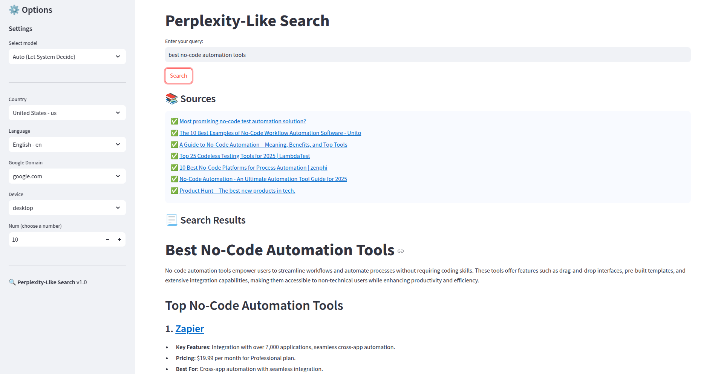
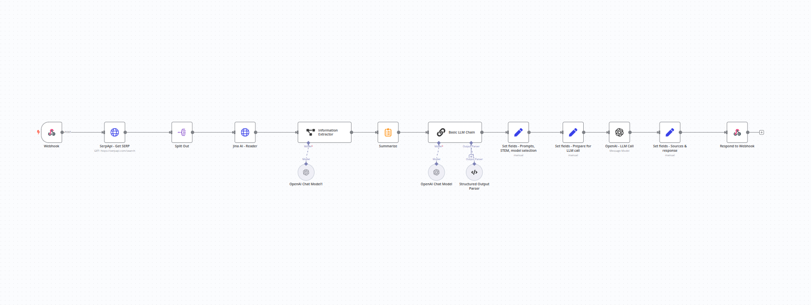

# 🔍 Perplexity-like App with Streamlit & n8n



## Overview

This is a **Perplexity-like application** that leverages **Streamlit** for the frontend and **n8n** as the backend to handle API calls and interact with Large Language Models (LLMs).

The app retrieves relevant sources, processes data into an LLM-friendly format, and generates AI-powered responses. It also includes **automatic STEM detection** to optimize the prompt and model choice accordingly.

The code in `app.py` is generated by **OpenAI o1**.

## 🛠️ Features

- **Interactive UI:** Built with Streamlit, featuring model selection, search customization, and results visualization.
- **Multiple LLM Models:** Choose response models manually or let the system decide automatically.
- **STEM Detection:** The n8n workflow determines whether a query is STEM-related and adjusts the prompt and model.
- **Google Search Integration:** Uses **SerpApi** to fetch web sources (Google-only in this version).
- **LLM-Friendly Content Processing:** Jina AI extracts and formats content for better LLM compatibility.
- **Response Generation:** OpenAI API extracts key information and generates AI-powered responses.
- **Security Best Practices:** Webhook authentication is required and should be stored securely.

## 🔗 APIs Used

| API        | Purpose |
|------------|---------|
| **SerpApi** | Retrieves web sources from Google. |
| **Jina AI** | Extracts and structures content in a markdown format optimized for LLMs. |
| **OpenAI API** | Processes queries, extracts information, and generates AI-powered responses. |

## 📦 Installation

### 1️⃣ Clone the Repository

```bash
git clone https://github.com/datakifr/perplexity-like.git
cd perplexity-like
```

### 2️⃣ Install Dependencies

Ensure you have Python installed, then install the required packages:

```bash
pip install -r requirements.txt
```

### 3️⃣ Import the n8n Workflow & Configure API Access


You need to import the n8n workflow located at:

```bash
n8n/workflow-n8n.json
```
- Go to your n8n instance (self-hosted or cloud).
- Navigate to Create Workflows > ... > Import from file.
- Import the file workflow-n8n.json 
- Configure the required API access keys (SerpAPI, Jina AI, OpenAI) inside n8n.
- Recommended: Set up authentication for your n8n webhook to enhance security.


### 4️⃣ Configure Secrets

Create or update the `.streamlit/secrets.toml` file to store sensitive credentials:

```toml
N8N_WEBHOOK_URL = "your-n8n-webhook-url"
AUTH_TOKEN = "your-secret-auth-token"
```

⚠️ **Important:** Securing the n8n webhook is strongly recommended to prevent unauthorized access.

### 5️⃣ Run the App

```bash
streamlit run app.py
```

## ⚙️ Configuration

The application supports customization through various input files:

| File | Description |
|------|-------------|
| `countries.csv` | List of country codes and names. |
| `languages.csv` | Supported languages for search queries. |
| `google_domains.txt` | Google search domain variations. |
| `devices.txt` | List of devices for search optimization. |

## 🖥️ Usage

1. **Enter a query** in the search bar.
2. **Select an LLM model** manually or allow auto-selection.
3. **Choose search settings**, including country, language, and device type.
4. Click **Search** and wait for the AI to generate a response.
5. View **sources and extracted information** from multiple web results.

## 🔒 Security Considerations

- Always **secure the n8n webhook** and use authentication tokens.
- Store sensitive data in `.streamlit/secrets.toml` and **never hardcode credentials**.
- Consider **rate limiting API requests** to avoid unnecessary costs.


---

Happy coding !
